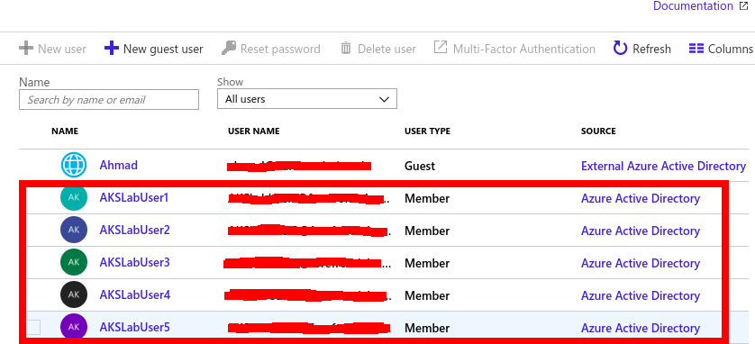
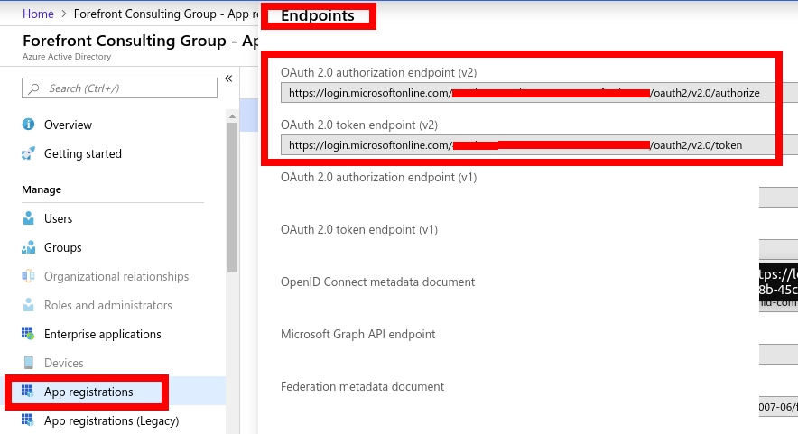
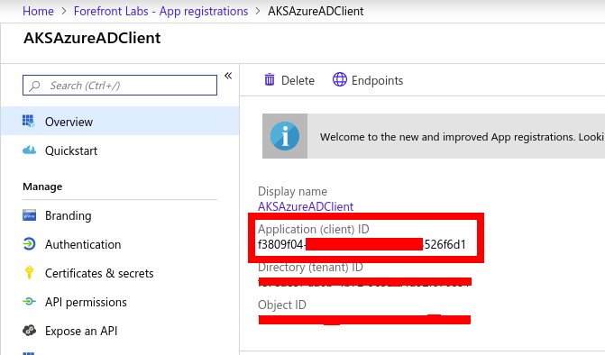
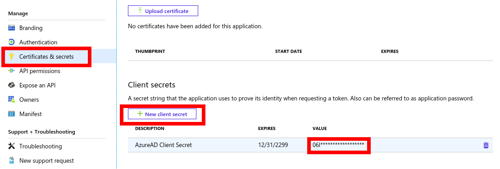
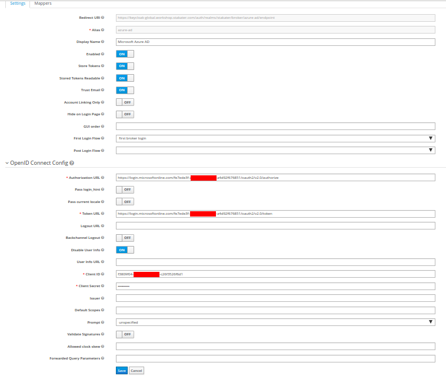

# Azure Active Directory with Azure Kubernetes Service

Azure Kubernetes Service (AKS) can be configured to use Azure Active Directory (AD) for user authentication. In this configuration, you can log into an AKS cluster using an Azure AD authentication token. Cluster operators can also configure Kubernetes role-based access control (RBAC) based on a user's identity or directory group membership.

- **Azure AD can only be enabled when you create a new, RBAC-enabled cluster. You can't enable Azure AD on an existing AKS cluster.**

- **When configuring Azure AD for AKS authentication, two Azure AD application are configured. This operation must be completed by an Azure tenant administrator.**

Following are the steps to deploy AKS (Azure Active Directory) with AAD (Azure Active Directory):
1. Create Azure AD Server Component
2. Create Azure AD Client COmponent
3. Deploy the cluster
4. Create RBAC binding
5. Access the cluster with Azure AD

All commands below will be run using Azure CLI. [Install Azure CLI here](https://docs.microsoft.com/en-us/cli/azure/install-azure-cli)

## Create Azure AD Server Component

Define a name for your cluster:
```
aksname="myakscluster"
```

Create the server application component:
```
# Create the Azure AD application
serverApplicationId=$(az ad app create \
    --display-name "${aksname}Server" \
    --identifier-uris "https://${aksname}Server" \
    --query appId -o tsv)

# Update the application group memebership claims
az ad app update --id $serverApplicationId --set groupMembershipClaims=All
```

Now create a service principal for the server app:
```
# Create a service principal for the Azure AD application
az ad sp create --id $serverApplicationId

# Get the service principal secret
serverApplicationSecret=$(az ad sp credential reset \
    --name $serverApplicationId \
    --credential-description "AKSPassword" \
    --query password -o tsv)
```

Add Permissions using the following command for:
- Read directory data
- Sign in and read user profile

```
az ad app permission add \
    --id $serverApplicationId \
    --api 00000003-0000-0000-c000-000000000000 \
    --api-permissions e1fe6dd8-ba31-4d61-89e7-88639da4683d=Scope 06da0dbc-49e2-44d2-8312-53f166ab848a=Scope 7ab1d382-f21e-4acd-a863-ba3e13f7da61=Role
```

Finally, grant the permissions assigned in the previous step for the server application:
```
az ad app permission grant --id $serverApplicationId --api 00000003-0000-0000-c000-000000000000
az ad app permission admin-consent --id  $serverApplicationId
```

## Create Azure AD Client component

Create the Azure AD app for the client component:
```
clientApplicationId=$(az ad app create \
    --display-name "${aksname}Client" \
    --native-app \
    --reply-urls "https://${aksname}Client" \
    --query appId -o tsv)
```

Create a service principal for the client application:
```
az ad sp create --id $clientApplicationId
```

Get the oAuth2 ID for the server app to allow the authentication flow between the two app components:
```
oAuthPermissionId=$(az ad app show --id $serverApplicationId --query "oauth2Permissions[0].id" -o tsv)
```

Add the permissions for the client application and server application components to use the oAuth2 communication flow:
```
az ad app permission add --id $clientApplicationId --api $serverApplicationId --api-permissions $oAuthPermissionId=Scope
az ad app permission grant --id $clientApplicationId --api $serverApplicationId
```

## Deploy the Cluster

With the two Azure AD applications created, now create the AKS cluster itself. First, create a resource group:
```
az group create --name myResourceGroup --location EastUS
```

Get the tenant ID of your Azure subscription using:
```
tenantId=$(az account show --query tenantId -o tsv)

az aks create \
    --resource-group myResourceGroup \
    --name $aksname \
    --node-count 5 \
    --generate-ssh-keys \
    --aad-server-app-id $serverApplicationId \
    --aad-server-app-secret $serverApplicationSecret \
    --aad-client-app-id $clientApplicationId \
    --aad-tenant-id $tenantId
```

Finally, get the cluster admin credentials:
```
az aks get-credentials --resource-group myResourceGroup --name $aksname --admin
```

## Create RBAC binding
Before an Azure Active Directory account can be used with the AKS cluster, a role binding or cluster role binding needs to be created. Roles define the permissions to grant, and bindings apply them to desired users. These assignments can be applied to a given namespace, or across the entire cluster. For more information, see [Using RBAC authorization](https://docs.microsoft.com/en-us/azure/aks/concepts-identity#role-based-access-controls-rbac).

Get the user principal name (UPN) for the user currently logged in:
```
az ad signed-in-user show --query userPrincipalName -o tsv
```

Create a YAML manifest named `basic-azure-ad-binding.yaml` and paste the following contents. On the last line, replace userPrincipalName_or_objectId with the UPN or object ID output from the previous command:

```
apiVersion: rbac.authorization.k8s.io/v1
kind: ClusterRoleBinding
metadata:
  name: cluster-admins
roleRef:
  apiGroup: rbac.authorization.k8s.io
  kind: ClusterRole
  name: cluster-admin
subjects:
- apiGroup: rbac.authorization.k8s.io
  kind: User
  name: userPrincipalName_or_objectId
```

Create the ClusterRoleBinding:
```
kubectl apply -f basic-azure-ad-binding.yaml
```

## Verify cluster with Azure AD
Test the integration of Azure AD authentication for the AKS cluster. Set the `kubectl` config context to use regular user credentials. This context passes all authentication requests back through Azure AD.
```
az aks get-credentials --resource-group myResourceGroup --name $aksname --overwrite-existing
```

Test by getting pods:
```
kubectl get pods --all-namespaces
```
You receive a sign in prompt to authenticate using Azure AD credentials using a web browser. After you've successfully authenticated, the kubectl command displays the pods in the AKS cluster.

## Configure KeyCloak with Microsoft Azure Active Directory

1. Create Users in Azure using the Administrator account using the [this](https://docs.microsoft.com/en-us/azure/active-directory/fundamentals/add-users-azure-active-directory). The new Users will be shown as source *Azure Active Directory* as below



2. Go to your Azure AD instance, select *App Registrations* on the left panel and click *Endpoints* on the top panel displayed. Copy values for *OAuth 2.0 authorization  endpoint (v2)* and *OAuth 2.0 token endpoint (v2)* values. these will be used in the Keycloak configurations.



3. Go to your Azure AD instance, select *App Registrations* on the left panel and Select Azure AD Client Application created when Azure Active directory was created. Copy the *Application (client) ID*.



4. Click *Certificates and Secrets* from the left panel and click *New Client Secret* button and create a new secret. Copy the value of the secret.



5. After the users are created open Keycloak administrative console and Select Identity Providers in the left panel.

6. Click on the Add Provider drop down and select OpenID Connect v1.0 

7. Fill in the Options as below:
  
    * alias: azure-ad
    * Display Name: Microsoft Azure AD
    * First login flow: first broker login
    * Authorization URL: (*OAuth 2.0 authorization  endpoint (v2)*)
    * Token URL: (*OAuth 2.0 token endpoint (v2)*)
    * Client ID: (*Application (client) ID*) from step 3
    * Client secret: client secret from step 3
    * Prompt: unspecified

8. Click Save to create the OIDC type Identity Provider. Final configurations:


9. Copy the Redirect URI form the created Identity Provider. In Azure AD instance go to App Registration, Select AD Client application, select Authentication, and paste this URI in Redirect URI field and type Web and click the add button to add.


10. Open any application that uses KeyCloak in browser to test Keycloak is working fine with Azure AD.

## Access Control using RBAC

When AKS cluster is deployed only admin has full access to the cluster. So we need to use the `az aks get-credentials` command with the `--admin` argument to sign in to the cluster with admin access.
```
az aks get-credentials --resource-group myResourceGroup --name $aksname --admin
```

In order to give a user permission to list pods. we need to create a Role and then create a ClusterRoleBinding for that user.

A role `pod-reader` which can `get`, `watch` and `list` pods:
```
kind: Role
apiVersion: rbac.authorization.k8s.io/v1
metadata:
  namespace: default
  name: pod-reader
rules: 
- apiGroups: [“”] # “” indicates the core API group
  resources: [“pods”]
  verbs: [“get”, “watch”, “list”]
```

A ClusterRoleBinding which will bind a user to the role `pod-reader`:
```
apiVersion: rbac.authorization.k8s.io/v1beta1
kind: ClusterRoleBinding
metadata:
  name: user-view
roleRef:
  apiGroup: rbac.authorization.k8s.io
  kind: ClusterRole
  name: view
subjects:
  - kind: User
    name: <USER_ID_FROM_AZURE_ACTIVE_DIRECTORY>
    apiGroup: rbac.authorization.k8s.io
```
apply these configurations using `kubectl apply -f` command.

Now the `user` with `<USER_ID_FROM_AZURE_ACTIVE_DIRECTORY>` ID will have a restricted access to list watch and get pods. Similarly other access controls can be applied on Services, Pods and other resources etc. using `RoleBinding/ClusterRoleBinding` on `Roles` as per requirement.