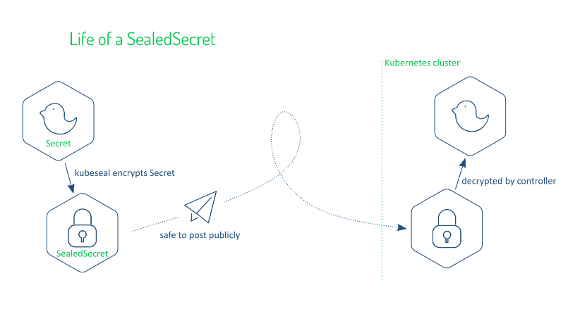

# Sealed Secret 

[](https://engineering.bitnami.com/articles/sealed-secrets.html)

## Overview

[SealedSecrets](https://github.com/bitnami-labs/sealed-secrets) controller solves the problem of storing kubernetes secret data securely by encrypting the configurations. It can only be decrypted by sealed secret controller running in cluster.

### Problem: Downside of Kubernetes Secrets

In Kubernetes Secrets, the data is stored as base64 encoded string, which is easily decryptable.

### Solution:

Sealed Secrets resolved the issue by encryting the data which is only decryptable by component of sealed secret running in cluster.

## Architecutre

SealedSecrets is composed of two components:

* `Controller`: A cluster-side controller/operator.
* `Kubeseal`: A client-side utility for data encryption. It uses asymmetric cryptography methods for data encryption.

### Working

SealedSecrets Controller generate a public/private key pair that it uses to encrypt/decrypt data. This key pair is generated once when the SealedSecrets Controller is deployed. The secrets sealed by one controller cannot be decrypted by another controller because the key pair is different for every deployed controller. 

SealedSecrets Controller stores key pair as a secret. To reuse the key pair, store the key pair secret locally (never check key pair on git) and apply the key pair secret when you want to reuse the key pair with a different controller.

Use the following command to get the key pair secret:

```bash
oc get secret sealed-secrets-name -n <namespace>
```

An example is of how sealed secret encryptes the data is given below:

**Data**

Following data needs to protected:

1- `mysql user`: root

2- `mysql password`: @mysqlpassword 

3- `mysql database`: test-database

**Unsealed Data**

Kubernetes secret:

```yaml
apiVersion: v1
kind: Secret
metadata:
  name: mysql-secrets
  namespace: nordmart-dev-apps
data:
  mysql_user: cm9vdA==  # <- base64 encoded root
  mysql_password: QG15c3FscGFzc3dvcmQ=  # <- base64 encoded @mysqlpassword
  mysql_database: dGVzdC1kYXRhYmFzZQ==  # -< base64 encoded test-database
```

**Sealed Data**

Encrypted kubernetes secret:

```yaml
apiVersion: bitnami.com/v1alpha1
kind: SealedSecret
metadata:
  name: mysql-secrets
  namespace: nordmart-dev-apps
spec:
  encryptedData:
    mysql_user: AgBy3i4OJSWK+PiTySYZZA9rO43cGDEq.....
    mysql_password: AyBQ@XZOSAK@+A@DZAASDasd21@6.....
    mysql_database: Raz+1@2ZQzia921@ea21@a21az23.......
```


